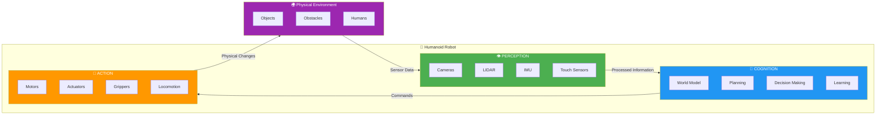

# Chapter 1: Introduction to Embodied AI

**Estimated Time**: 3-4 hours
**Prerequisites**: Basic Python programming (variables, functions, loops), comfort with command-line interfaces

## Learning Outcomes

By the end of this chapter, you will be able to:

- Define Embodied AI and distinguish it from disembodied AI applications
- Explain the significance of physical embodiment for intelligence
- Identify real-world applications of Embodied AI systems
- Successfully configure a simulation environment for subsequent chapters

---

## 1.1 What is Embodied AI?

### The Embodiment Hypothesis

Embodied AI represents a fundamental shift in how we think about artificial intelligence. While traditional AI systems operate entirely in the digital realm—processing text, images, or data without any physical presence—Embodied AI systems interact directly with the physical world through sensors and actuators.

The **embodiment hypothesis** proposes that true intelligence requires a physical body. This idea, championed by researchers like Rodney Brooks and Rolf Pfeifer, suggests that cognition emerges from the continuous interaction between an agent's body and its environment.

### Disembodied vs. Embodied AI

| Aspect | Disembodied AI | Embodied AI |
|--------|----------------|-------------|
| Environment | Digital/virtual | Physical world |
| Input | Structured data, text, images | Raw sensor data (noisy, continuous) |
| Output | Predictions, text, classifications | Physical actions (movement, manipulation) |
| Time constraints | Often batch processing | Real-time, safety-critical |
| Consequences | Digital errors | Physical consequences (damage, injury) |

**Examples of Disembodied AI**:
- Chatbots and language models
- Recommendation systems
- Image classifiers
- Game-playing AI (chess, Go)

**Examples of Embodied AI**:
- Autonomous vehicles
- Warehouse robots
- Surgical robots
- Drones and UAVs
- Humanoid robots

### Why Embodiment Matters

Physical embodiment introduces challenges that purely digital systems never face:

1. **Sensor noise and uncertainty**: Real sensors provide imperfect, noisy data
2. **Real-time constraints**: Physical actions cannot be undone; decisions must be timely
3. **Safety requirements**: Mistakes can cause physical harm
4. **Environmental variability**: The real world is unpredictable and constantly changing

---

## 1.2 The Physical AI Pipeline

Every Embodied AI system follows a fundamental pipeline: **Perception → Planning → Actuation**

### Perception

The perception stage transforms raw sensor data into meaningful representations of the world. This includes:

- **Sensing**: Gathering data from cameras, LIDAR, touch sensors, IMUs
- **Processing**: Filtering noise, fusing data from multiple sensors
- **Understanding**: Building models of objects, obstacles, and the environment

### Planning

The planning stage decides what actions to take based on perceived information:

- **Goal representation**: Understanding what needs to be achieved
- **Path planning**: Finding routes through the environment
- **Decision making**: Choosing between alternative actions
- **Prediction**: Anticipating future states and consequences

### Actuation

The actuation stage executes physical actions in the world:

- **Motor control**: Sending commands to motors and actuators
- **Feedback loops**: Adjusting actions based on sensor feedback
- **Force control**: Managing physical interactions with objects

### The Continuous Loop

Unlike batch-processing systems, Embodied AI operates in a continuous loop. This **Perception-Cognition-Action** cycle runs constantly, enabling the robot to respond to changes in its environment in real-time:



**Key aspects of the loop:**

- **Perception** gathers raw sensor data and transforms it into meaningful representations
- **Cognition** reasons about the world, plans actions, and makes decisions
- **Action** executes physical movements that change the environment
- **Feedback** completes the loop—actions change the environment, which is then re-perceived

---

## 1.3 Real-World Applications

### Autonomous Vehicles

Self-driving cars represent one of the most ambitious Embodied AI applications:

- **Perception**: Cameras, LIDAR, radar detect roads, vehicles, pedestrians
- **Planning**: Route planning, lane changes, intersection navigation
- **Actuation**: Steering, acceleration, braking

### Warehouse Robotics

Companies like Amazon use thousands of mobile robots for logistics:

- **Perception**: Floor markers, obstacle detection, package recognition
- **Planning**: Optimal paths through warehouse, collision avoidance
- **Actuation**: Navigation, shelf lifting, package handling

### Surgical Robots

Systems like da Vinci enable minimally invasive surgery:

- **Perception**: Stereo cameras, force sensing
- **Planning**: Instrument positioning, tremor filtering
- **Actuation**: Precise micro-movements of surgical instruments

### Agricultural Robots

Autonomous systems for farming and harvesting:

- **Perception**: Crop detection, ripeness assessment
- **Planning**: Field coverage, selective harvesting decisions
- **Actuation**: Navigation, picking, spraying

---

## 1.4 Setting Up Your Development Environment

### Simulation-First Approach

Before working with physical robots, you will develop and test in simulation. This approach offers several advantages:

- **Safety**: No risk of damaging equipment or causing injury
- **Speed**: Faster iteration cycles than physical experiments
- **Reproducibility**: Exact conditions can be replicated
- **Cost**: No expensive hardware required

### Required Software

For this book, you will use the following tools:

1. **Python 3.9+**: The primary programming language
2. **PyBullet**: Physics simulation engine
3. **NumPy**: Numerical computing library
4. **Matplotlib**: Visualization library

### Installation Steps

#### Step 1: Create a Virtual Environment

```python
# Create a new virtual environment
python -m venv physical-ai-env

# Activate the environment (Windows)
physical-ai-env\Scripts\activate

# Activate the environment (macOS/Linux)
source physical-ai-env/bin/activate
```

#### Step 2: Install Required Packages

```python
# Install the core packages
pip install pybullet numpy matplotlib

# Verify installation
python -c "import pybullet; print('PyBullet version:', pybullet.getPhysicsEngineParameters())"
```

#### Step 3: Run Your First Simulation

```python
import pybullet as p
import pybullet_data
import time

# Connect to the physics server with GUI
physics_client = p.connect(p.GUI)

# Set the path to built-in models
p.setAdditionalSearchPath(pybullet_data.getDataPath())

# Load a ground plane
plane_id = p.loadURDF("plane.urdf")

# Load a robot model
robot_id = p.loadURDF("r2d2.urdf", [0, 0, 0.5])

# Set gravity
p.setGravity(0, 0, -9.81)

# Run simulation for 5 seconds
for i in range(500):
    p.stepSimulation()
    time.sleep(1./240.)

# Disconnect
p.disconnect()
```

**Expected Output**: A window opens showing a ground plane with the R2D2 robot model. The robot should fall and settle on the ground due to gravity.

---

## Hands-On Exercises

### Exercise 1.1: Identify Embodied AI Applications

For each scenario below, identify whether it is Embodied AI or Disembodied AI, and explain your reasoning:

1. A robot vacuum cleaner navigating your home
2. A spam filter classifying emails
3. A drone delivering packages
4. A voice assistant answering questions
5. A robotic arm welding car parts

### Exercise 1.2: Pipeline Analysis

For a delivery drone, describe what happens at each stage of the Physical AI pipeline:

1. What sensors does it use for perception?
2. What decisions must the planning stage make?
3. What actuators execute the physical actions?

### Exercise 1.3: Environment Verification

Complete the installation steps and run the first simulation. Document:

1. The Python version you installed
2. Any errors encountered and how you resolved them
3. A screenshot of the simulation window

---

## Summary

In this chapter, you learned:

- **Embodied AI** systems interact with the physical world through sensors and actuators
- The **embodiment hypothesis** suggests physical presence is essential for true intelligence
- All Embodied AI systems follow the **Perception → Planning → Actuation** pipeline
- Real-world applications include autonomous vehicles, warehouse robots, surgical systems, and agricultural robots
- **Simulation** provides a safe, fast, and cost-effective way to develop Embodied AI

---

## Key Terms

- **Embodied AI**: AI systems with physical presence that interact with the real world
- **Perception**: The process of gathering and interpreting sensor data
- **Planning**: Decision-making about what actions to take
- **Actuation**: Executing physical actions in the world
- **Simulation**: Virtual environment for testing without physical hardware

---

## Next Chapter Preview

In Chapter 2, you will dive deep into **Sensors and Perception**—learning about the different types of sensors used in physical AI systems and how to process their data into useful information.
